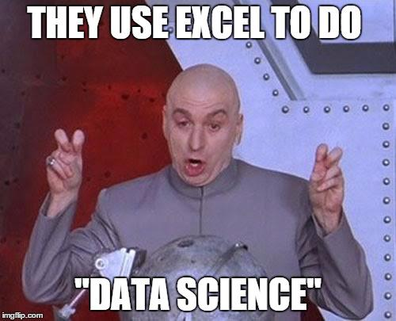

```{r setup, include=FALSE}
knitr::opts_chunk$set(echo = TRUE, message = FALSE, warning = FALSE)
```

There is many a data science meme degrading excel:

{width=60%}

(Google Sheets seems to have escaped most of the memes here.)

{width=60%}

While I no longer use it regularly for the purposes of anlaysis, I will always have a soft spot in my heart for excel[^soft-spot]. Furthermore, using a "correct" set of data science tools often requires a bridge^[For me the bridge came from a friend in my Master's program who inspired me to embrace R -- before that, I'd had the moniker of "excel wizard" from my classmates in graduate school.]. Integrating a rigorous component into a messy spreadsheet based pipeline can be an initial step towards the pipeline or team or organization starting on a path of continuous improvement in their processes^[Or it may simply add another layer of complexity.]. Also, spreadsheets are foundational to many (probably most) BizOps teams and therefore are sometimes unavoidable...

In this post I will walk through a short example and some considerations for when you might decide (perhaps against your preferences) to integrate your work with extant spreadsheets or shadow "pipelines" within your organization. 

[^soft-spot]: For those without CS backgrounds, excel, or BI tools are typically the first analytics tools you get exposed to. Excel's "Record Macro" feature (which enables watching VBA commands be generated while clicking through excel's GUI / clicking through spreadsheets) was a helpful step towards me feeling comfortable with scripting. I also believe in the saying that *it doesn't matter so much what you have, but how you use it* (this applies broadly to analytics technologies) and have seen many people make impressive things happen with it.

# Macro in the Shell

{width=60%}

Say your finance organization has some workbook that contains fancy accounting triggered by a VBA macro, the calculation of which you need in your own *script based* data pipeline (but which also may not be in *perfect* order^[e.g. it is being run on a local machine, it is not updated on a fully automated basis, some parts have to be inputted manually, etc. EVERY DATA SCIENTIST HAS THEIR SKELETONS!]...). You don't want to go through the effort of reproducing (or worse, be responsible for maintaining) the complicated (and potentially changing) logic that lives within the spreadsheets / macros^[It may not be possible anyways if there is already an established user base for the existing tool... or may require a whole change management process which you can't commit to.]. You've resolved instead to simply "call" finances spreadsheet / macro / logic in some way. 

Often the VBA from finance will live in a macro enabled workbook (.xlsm file). To trigger it programatically, you generally want to write a wrapper VBscript that can then be run through the shell (Stack Overflow [thread](https://stackoverflow.com/questions/2050505/way-to-run-excel-macros-from-command-line-or-batch-file))^[You can run shell commands through R by running `system()` or `shell()` functions, SO [thread](https://stackoverflow.com/questions/19404270/run-vba-script-from-r) -- see [Related Alternative] in the [Appendix].]. The VBscript will open the workbook and trigger the macro(s) of interest^[Finance might have a VB wizard that can set this up for you.].

Note that saying "Use a shell script" is, in a way, almost always an answer for how to incorporate another technology into a pipeline. This is more just a reminder that many tools that are designed more for interactive use often also have a batch mode^[You could even say this about {dplyr} and tidyverse tools which are largely designed with the intent of making interacton and fast iteration easy at the expense of making programming and functional programming and automation slightly more difficult.]. Here I'm writing about triggering VBA macros, but integrating GUI based data piplining tools like [Orange](https://orangedatamining.com/) or [Knime](https://www.knime.com/) into your pipeline can be set-up [similarly](https://forum.knime.com/t/execute-workflow-in-batch-mode-windows-10/13986).

**Passing in arguments**

You can pass arguments to a VBScript through the shell ([SO thread](https://stackoverflow.com/questions/45622497/how-to-run-a-vbs-script-from-r-while-passing-arguments-from-r-to-vbs)). Though given that you are already using spreadsheets, it's also sometimes easier to write data to pre-determined locations or cells (this is often how the workbook was set-up to be used anyways).

## Example

See [brshallo/macros-shell-examle](https://github.com/brshallo/macro-shell-example) for a walk-through involving evaluating the present values of predicted deals. 

In the example I...

1. *pass predictions programatically through an excel workbook* -->  
2. *that calculates present value via macros and excel formulas* -->  
3. *which is then read back in from the spreadsheet programatically.*

These steps are orchestrated via a "[run-all.R](https://github.com/brshallo/macro-shell-example/blob/master/R/run-all.R)" script. With a little more effort these could be formalized via [targets](https://github.com/ropensci/targets) (or your pipeline toolkit of choice).

# Setting-up Gaurd Rails

There are many unavoidable limitations to any spreadsheet dependant data pipeline. But here are a few things you can do to keep things sane:

1. Think of your relationship with the workbook/macro/document in a somewhat similar way to how you might consider your relationship with an API or database you depend on. Get the owner of the document to think similarly -- that is, as the owner of a standardized interface.

Identify which parts of the document need to stay consistent for your pipeline to keep working^[While ensuring that whatever understanding you have allows flexibility for the owner to adjust the tool (but in a way that keeps in mind dependencies).], e.g. 

* Location(s) where new data is to be inputted (e.g. a database, folder of .csv files, arguments passed through the shell script)
* Location(s) where you expect to retrieve data
* Names, data types, and possible values^[Nothing is more frustrating than when a data source changes arbitrarily and without notice.]

These are not much different from the kinds of considerations that happen when collaborating on any data pipeline^[Even those handled entirely programatically.]. The responsible party at each step has to adhere to certain structures about the form of the data as they expect it to come-in and the form with which it will proceed to the next step. Lines of communication should be open so that as changes occur to the tool, everyone (who needs to be) is made aware^[These guidelines/requirements are pretty similar to those you would have on any collaborative project.].

2. Set-up notifications / methods of contact.

Particularly if the pipeline is used in the wild^[I.e. being used in some way by people other than yourself or your immediate team.], make it easy to get notifications for when things *do* break^[For informal pipelines such as the ones you are likely looking at in regards to this post, this can be as simple as including an email that people should reach if things break, or triggering an auto-generated email populating an error message, e.g. via the [blastula](https://github.com/rstudio/blastula) package in R.].

3. Basic optimizations

If you are using spreadsheets or VBA macros in your data pipeline you probably aren't worried *too* much about performance, but there may be a few things you can do to be more efficient. 

For example, for the [macro-shell-example](https://github.com/brshallo/macro-shell-example), the VB script has as (headless) steps opening and closing the excel document after processing each deal. Therefore, proccessing five deals entails compute time spent on four unnecessary opens and closes. This wasted processing could be corrected with small changes to the VB Script.

# Closing

Data Scientists should still consider their work in a context of growth & development. I am reminded of the Alan Watts quote:

> "People who are responsible for technical development [must] be well-imbued with an ecological philosophy and see the direction of things so they will not keep perpetuating anachronisms."

For further reading on how data scientists should think about integrating their knowledge into sometimes lower-tech organizational contexts, see the excellent post by [Allison Horst](https://twitter.com/allison_horst) and [Jacqueline Nolis](https://twitter.com/skyetetra):

"[Merge conflicts](https://jnolis.com/blog/training_ds_for_teams/): helping data science students merge their advanced skills into existing teams...  
*What do we do about students trained in R and Python for jobs with Excel, Google Sheets and Access?"*

# Appendix

## Related Alternative

You can also use the [RDCOMClient](https://github.com/omegahat/RDCOMClient) or [excel.link](https://cran.r-project.org/web/packages/excel.link/excel.link.pdf) package. These essentially do the same thing but allow you to circumvent the need to write a separate VBscript. They do require a Windows operating system though. These tools are also helpful if you need to read or write to open workbooks for some reason.

## Other Resources

A few other tools worth being aware of if you regularly interface with office products from R.

* [Microsoft365R](https://github.com/Azure/Microsoft365R) 
* [officeverse](https://ardata-fr.github.io/officeverse/index.html) 
* [R markdown](https://bookdown.org/yihui/rmarkdown/) etc.

For integrating with google sheets there is [googlesheets4](https://github.com/tidyverse/googlesheets4).