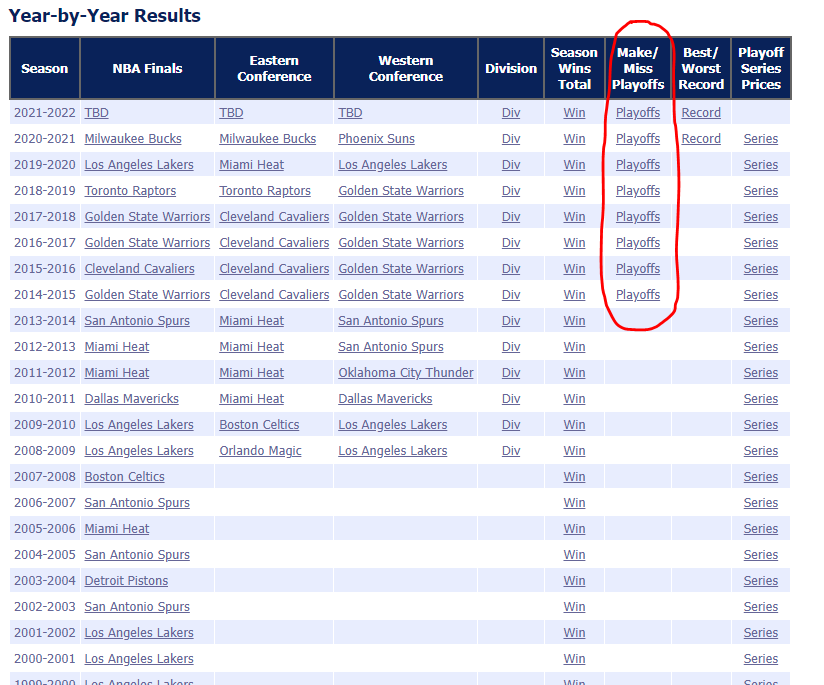
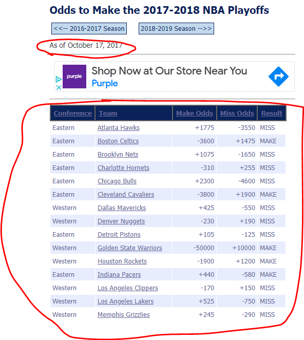

```{r setup, include=FALSE}
knitr::opts_chunk$set(echo = TRUE, warning = FALSE, message = FALSE)
```

**TLDR:** *FiveThirtyEight forecasts of NBA playoff berths seem to hold-up OK against betting markets.*

In [The Virtues and Vices of Election Prediction Markets](https://fivethirtyeight.com/features/oct-23-the-virtues-and-vices-of-election-prediction-markets/) Nate Silver explains why [FiveThirtyEight](https://fivethirtyeight.com/) generally should *not* beat the market:

>"The general question of whether FiveThirtyEight ought to be better than prediction and betting markets is an interesting one. I am far from an efficient-market hypothesis purist, but markets are tough to beat in most circumstances. Furthermore, the FiveThirtyEight forecasts are public information, and bettors can use our forecasts along with those of our competitors to calibrate their estimates of the outcomes."

However FiveThirtyEight is doing a lot more with their forecasts than *just* predicting outcomes. Their forecasts provide the foundation of their data journalism covering interesting trends in sports and politics. 

We should expect FiveThirtyEight's forecasts to have some tradeoffs between optimizing for performance and achieving their other goals of having explainabile, constructabile, and consistent forecasts. Their NBA model is based on a blend of team and individual player performance and is designed with various linear constraints in place that make it explainable to the public (see: [How Our NBA Predictions Work](https://fivethirtyeight.com/methodology/how-our-nba-predictions-work/#:~:text=Game%20predictions&text=For%20a%20given%20lineup%2C%20we,the%20court%20at%20all%20times). However performance costs shouldn't be *too* high -- afterall our trust in FiveThirtyEight's explanations is in large part dependent on their models' predictive power.

**The public *should* root for forecasters like FiveThirtyEight**

Where betting markets exist, public forecasts like FiveThirtyEight's add information into the system and can help markets reach more efficient prices. Where markets don't exist, we are limited to the power of such forecasting processes -- be it government impact assessments, weather forecasts, disease modeling... society gains as predictive power improves^[Public forecasting organizations like FiveThirtyEight also help promote data literacy and inspire improved predictive practices]. 

# NBA Playoffs and the Lakers

I was struck the other day by how big of a difference FiveThirtyEight's forecast of whether the Lakers would make the playoffs was from that of the betting markets. This one-off observation made me wonder about their comparative performance and I remarked that they should add an additional reference to their documentation of [How Good are FiveThirtyEight Forecasts](https://projects.fivethirtyeight.com/checking-our-work/nba-playoffs/)^[While I think betting markets would be an ideal comparison point, a comparison against something simple like, "the teams with the best record will at this point will make the playoffs" or "the teams that made it to the playoffs last year will make it this year" would also represent improved comparison points.]:

<blockquote class="twitter-tweet"><p lang="en" dir="ltr">Can <a href="https://twitter.com/FiveThirtyEight?ref_src=twsrc%5Etfw">@FiveThirtyEight</a> please add the brier score of betting markets to their performance comparison charts?<br><br>(Perhaps just convert +/- payouts to implied probabilities.) <a href="https://t.co/5TkE2XE48D">pic.twitter.com/5TkE2XE48D</a></p>&mdash; Bryan Shalloway (@brshallo) <a href="https://twitter.com/brshallo/status/1467868595258548232?ref_src=twsrc%5Etfw">December 6, 2021</a></blockquote> <script async src="https://platform.twitter.com/widgets.js" charset="utf-8"></script>

I could not (immediately) find performance comparisons beween betting markets and FiveThirtyEight forecasts of *NBA playoffs*, so decided to pull the data and write this post^[I did found some [writeups](https://www.sportstradingnetwork.com/article/pinnacle-versus-fivethirtyeight-a-comparison-of-predictive-success/) reviewing other FiveThirtyEight forecasts.].

[Analysis] Spoiler: Turns out, FiveThirtyEight holds-up pretty well.

# Data Prep

## Scraping Betting Markets

I scraped the data of historical betting markets and which teams actually made the playoffs each season from the "Archived NBA Futures Odds" section of [Sports Odds History](https://www.sportsoddshistory.com/nba-odds/) using the [rvest](https://github.com/tidyverse/rvest) package. The Sports Odds History website is constructed in a way that makes it relatively straight-forward to scrape the requisite information.



The webpage for each season had a (mostly) consistent table structure and associated date of archive.



Each season had a consistent URL (with only the season year changing).


### Steps

1. Create table with URL's to scrape
2. For each URL repeat steps 3 to 6
3. Scrape table containing Teams, betting odds, and outcomes (whether team actually made it to playoffs that season)
4. Convert from betting lines to odds (e.g. +400 becomes 0.25)
5. Tables contain the betting odds for both "making the playoffs" and "missing the playoffs" you might expect these to be inverses of one another, but they actually are slightly different -- the difference provides room for The House to make a profit. (This might be generous to the betting markets) I took the average of the implied odds of making the playoffs between both columns ("make" and "miss") to get at what is likely a closer estimate of where the betting markets actually expect the line to be.
6. Scrape associated date and join to table
7. Bind data from all seasons together
8. Convert from odds to probability

I've labeled each respective `# step` in the code.

**Packages and helper functions**

```{r}
# Load packages
library(tidyverse)
library(rvest)
library(gt)
library(broom)

# Helper functions
# Some of the tables had the lines represented as character strings like "+400"
# "-300". This converts those to a numeric type (if they're not  already).
odds_to_numeric <- function(x){
  if(is.numeric(x)) return(x)
  sign <- str_sub(x, 1, 1)
  sign <- case_when(sign == "-" ~ -1,
                    sign == "+" ~ 1)
  x_dbl <- str_sub(x, 2) %>% as.double()
  x_dbl * sign
}

# -400 would be converted to 4, +400 to 0.25
line_to_odds <- function(x){
  positive <- sign(x) == 1
  abs_x <- abs(x)
  case_when(positive ~ 100 / abs_x ,
            !positive ~ abs_x / 100)
}

odds_to_prob <- function(odds){
  odds / (1 + odds)
}
```

**Step 1**

```{r}
# step 1
scrape_urls <- tibble(start_yr = 2014:2020, end_yr = 2015:2021) %>% 
  mutate(yr = paste0(start_yr, "-", end_yr),
         urls = glue::glue(
           "https://www.sportsoddshistory.com/nba-win/?y={yr}&sa=nba&t=post&o=s",
           yr = yr
         ))


scrape_urls %>% 
  gt::gt()
```

**Steps 2-6**

*Custom scraping function:*

```{r}
scrape_nba_playoffs_odds <- function(url){
  
  css_selector_tbl <- "#content > div > table.soh1"
  
  html_page <- url %>% 
    read_html()
  
  # step 3
  data <- html_page %>% 
    html_element(css = css_selector_tbl) %>% 
    html_table() %>% 
    janitor::clean_names() %>% 
    mutate(
      # step 4
      across(contains("odds"),
             list(dbl = ~odds_to_numeric(.x) %>% 
                    line_to_odds())),
      # step 5
      make_odds_avg = (make_odds_dbl + 1 / miss_odds_dbl) / 2)

  html_kids <- html_page %>% 
    html_element(css = "#content > div") %>% 
    html_children() %>% 
    html_text2()
  
  # step 6
  phrase_date <- "As of "
  date_taken <- html_kids %>% 
    str_subset(phrase_date) %>% 
    str_extract(glue::glue("(?<={phrase_date}).+")) %>% 
    lubridate::mdy()
  
  data %>% 
    mutate(forecast_date = date_taken) %>% 
    # type varied between webpages so force to chr so can bind multiple...
    mutate(across(c(make_odds, miss_odds), as.character)) %>% 
    relocate(forecast_date)
}
```

*`map()` function to `scrape_nba_playoffs_odds()` on urls*
```{r}
# Step 2 (applies steps 3 through 6 on each URL)
scraped_urls <- scrape_urls %>% 
  mutate(data = map(urls, scrape_nba_playoffs_odds))
```

**Steps 7-8**
```{r}
odds_data_prepped <- scraped_urls %>% 
  select(season = end_yr, data) %>% 
  # step 7
  unnest(data) %>% 
  arrange(desc(season)) %>% 
  mutate(
    # step 8
    make_playoffs_bookies = odds_to_prob(make_odds_avg),
    result = ifelse(result == "MAKE", 1, 0)
    ) %>% 
  select(season, forecast_date, team, result, make_playoffs_bookies) %>% 
  mutate(team = str_extract(team, "(?<=[:blank:])[:alnum:]+$"))
```

## Joining with FiveThirtyEight data

9. All FiveThirtyEight forecasts were available in a .csv on github [here](https://github.com/fivethirtyeight/checking-our-work-data/blob/master/nba_playoffs.csv).
10. FiveThirtyEight updates their forecasts *every* day but for the betting markets I only have *one* day of forecasts for each season. I filtered FiveThirtyEight forecasts to *just* those days that I had market data (so that the forecasts and betting markets being compared were created the same day)
11. Joined FiveThirtyEight forecasts with betting market and outcome data.
12. Betting market data was not available for a few teams in some seasons -- these records were removed.

**Steps 9 to 12**

```{r}
# step 9
data_538 <- read_csv("https://raw.githubusercontent.com/fivethirtyeight/checking-our-work-data/master/nba_playoffs.csv")

bookies_538_joined <- data_538 %>% 
  # step 10
  filter(forecast_date %in% unique(odds_data_prepped$forecast_date)) %>% 
  select(season, forecast_date, team, make_playoffs_538 = make_playoffs) %>% 
  # step 11
  left_join(odds_data_prepped, by = c("season", "team", "forecast_date")) %>% 
  # step 12
  na.omit() %>% 
  # mutate(make_playoffs_avg = (make_playoffs_538 + make_playoffs_bookies) / 2) %>% 
  relocate(result, .after = team)
```

*Resulting table, ready for analysis (first 5 rows of)*

```{r}
bookies_538_joined %>% 
  head(5) %>% 
  gt::gt() %>% 
  gt::fmt_number(decimals = 3, columns = c("make_playoffs_538", "make_playoffs_bookies"))
```

```{r, include = FALSE}
# with scraped data probably a good idea to output to a .csv in the case that
# the website changes in the future
fs::dir_create("data")

bookies_538_joined %>% 
  write_csv("data/bookies_538_joined.csv")
```

# Analysis

FiveThirtyEight tends to use the [Brier Score](https://en.wikipedia.org/wiki/Brier_score) (essentially the root mean squared error of the classification) in their performance evaluations[^perf-note].

[^perf-note]: Their article on [Some Do's and Don't's For Evaluating Senate Forecasts](https://fivethirtyeight.com/features/some-dos-and-donts-for-evaluating-senate-forecasts/) is a good read. I've remarked in the past on the differences in their performance evaluation from methods used by more pure ML and kaggle people:
    
    ><blockquote class="twitter-tweet"><p lang="en" dir="ltr">Why do <a href="https://twitter.com/kaggle?ref_src=twsrc%5Etfw">@kaggle</a> and more ML people use log loss but <a href="https://twitter.com/FiveThirtyEight?ref_src=twsrc%5Etfw">@FiveThirtyEight</a> <a href="https://twitter.com/superforecaster?ref_src=twsrc%5Etfw">@superforecaster</a> and more probabilistic forecasting sites lean towards Brier Score?<br><br>(1/3)</p>&mdash; Bryan Shalloway (@brshallo) <a href="https://twitter.com/brshallo/status/1468805245551591432?ref_src=twsrc%5Etfw">December 9, 2021</a></blockquote> <script async src="https://platform.twitter.com/widgets.js" charset="utf-8"></script>

A quick t-test suggests no significant difference in performance between betting markets and FiveThirtyEight.

*Overall*

```{r}
### helper functions
t_test_playoffs <- function(df){
  df %>% 
    with(t.test(make_playoffs_538, make_playoffs_bookies)) %>% 
    broom::tidy() %>% 
    select(
      estimate_diff = estimate,
      estimate_538 = estimate1,
      estimate_bookies = estimate2,
      p.value,
      starts_with("conf")
    )
}

gt_format_output <- function(df){
  df %>% 
    rename_with(~str_replace(.x, "estimate_", "Brier.score.")) %>% 
    gt::gt() %>% 
    gt::fmt_number(columns = contains("."),
                   decimals = 3) %>% 
    gt::tab_style(style = list(cell_text(weight = "bold")),
                locations = cells_body(columns = "p.value"))
}
###

bookies_538_joined %>% 
  mutate(across(starts_with("make_playoffs"), ~(result - .x)^2)) %>% 
  t_test_playoffs() %>% 
  gt_format_output()
```

*By Season*

```{r}
bookies_538_joined %>% 
  mutate(across(starts_with("make_playoffs"), ~(result - .x)^2)) %>% 
  group_nest(season) %>% 
  mutate(t_test = map(data, t_test_playoffs)) %>% 
  select(-data) %>% 
  unnest(t_test) %>% 
  gt_format_output()
```

Other ways to segment this could be by make/miss playoffs, high/low forecasted probabilities, reviewing an ensemble of bookies and 538 forecasts... but I don't really expect any of these to be interesting so I'll leave it there^[And give a hat-tip to FiveThirtyEight for not getting creamed by the betting markets.].

## How much does FiveThirtyEight differ from markets?

Circling back, what got me writing was noticing a large one-off difference between FiveThirtyEight and betting markets in their view of the Lakers playoff chances:

<blockquote class="twitter-tweet"><p lang="en" dir="ltr">When I see big differences i get tempted to write-off 538.<br><br>But maybe it&#39;s just different but still meaningful (even if less performative at margins).<br><br>I don&#39;t look at it systematically enough to know (so why another comparison point--eg betting markets--would be helpful).</p>&mdash; Bryan Shalloway (@brshallo) <a href="https://twitter.com/brshallo/status/1467868598576328714?ref_src=twsrc%5Etfw">December 6, 2021</a></blockquote> <script async src="https://platform.twitter.com/widgets.js" charset="utf-8"></script>

At -460 this would put the implied probability of the Lakers making the playoffs at ~82%^[Note that I'm just using the line for "make playoffs" in the above analysis I'd taken the average of the odds of "making the playoffs" and the inverse of "missing the playoffs"...]. This makes the difference between FiveThirtyEight's forecast (27% chance Lakers make the playoffs) and the betting markets ~55 percentage points (ppt).

The average difference between FiveThirtyEight and betting markets across five seasons (145 observations) of data was ~10 percentage points.

```{r}
bookies_538_joined %>% 
  mutate(diff = abs(make_playoffs_538 - make_playoffs_bookies)) %>% 
  # summarise(mean_diff = mean(diff)) %>% 
  with(t.test(diff)) %>%
  broom::tidy() %>%
  select(avg_abs_ppt_diff_538_bookies = estimate, contains("conf")) %>%
  gt::gt() %>%
  gt::fmt_number(columns = everything(),
                 decimals = 3)
```

A difference of 55 ppt is bigger than any I saw in the historical data. The closest was 48 percentage points:

```{r}
bookies_538_joined %>% 
  mutate(make_playoffs_diff = abs(make_playoffs_538 - make_playoffs_bookies)) %>% 
  arrange(desc(make_playoffs_diff)) %>% 
  head(1) %>% 
  gt::gt() %>%
  gt::fmt_number(columns = contains("make_playoffs"),
                 decimals = 3)
```

In the [Appendix] I give some [Potential Reasons for the Difference] but on its surface 55 ppt does seem like a historically large divergence between FiveThirtyEight and the betting markets.

Given the (apparent) relative parity in performance between FiveThirtyEight and the betting markets, it may not be clear who you should bet on. For the reasons given in the Introduction, I would lean towards trusting the betting markets -- I would be surprised if, after looking at a larger swathe of data, the markets did not come-out significantly better than FiveThirtyEight^[Though perhaps the magnitude of the difference may be small.]. But the [current line](https://sportsbook.draftkings.com/nba-finals?category=wins/playoffs&subcategory=to-make-the-playoffs) on draft kings of +450 of the Lakers *not making* the playoffs is perhaps an opportunity that deserves a closer look^[Maybe at some point in the future I'll review hypothetical outcomes of various strategies.]...

# Appendix

## Potential Reasons for the Difference

Some reasons why the 55 ppt difference between FiveThirtyEight and betting markets (in regards to their projection of making the playoffs) may not be as extreme as it seems:

* My historical data is looking at individual time-point comparisons at just one point for each season -- perhaps betting markets and FiveThirtyEight vary more from one another at different points in the year than those at the points I have..
* Lines (according to Sports Odds History) come from BetMGM, each betting market is different
* I was looking at just the odds of "making the playoffs" not the average of that with the inverse of "odds to miss" as I did in step 5 of [Steps].
* Changes in methodology of more recent forecasts may have made it depart more from betting markets compared to in prior years

## Calculating percentiles of diff

Initially I'd planned on including the calculation of some percentiles of various differences in percentage points. Saved code from examples below.

```{r, eval = FALSE}
one_off_diff <- 0.27 - odds_to_prob(line_to_odds(-460))

bookies_538_joined %>% 
  mutate(diff = abs(make_playoffs_538 - make_playoffs_bookies)) %>% 
  summarise(percentile_of_difference = sum(diff < one_off_diff) / n())

# Alternative approach for calculating one-off diff
ecdf_diffs <- bookies_538_joined %>% 
  mutate(diff = abs(make_playoffs_538 - make_playoffs_bookies)) %>% 
  with(ecdf(diff))

ecdf_diffs(one_off_diff)
```