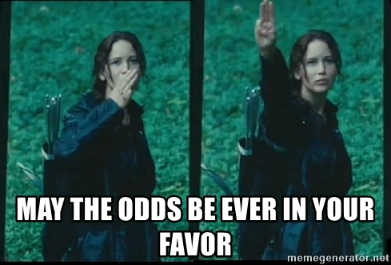
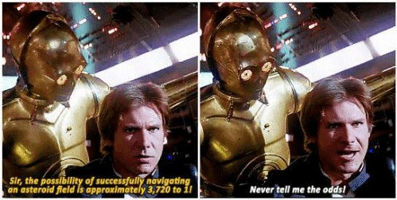

```{r, include=FALSE}
knitr::opts_chunk$set(echo = TRUE, cache = TRUE, message = FALSE, warning = FALSE)
```

We grow up learning proportions, percentages, risks, probabilities.  You encounter them when a teacher gives a grade on a test or a doctor describes the risk of an illness. On the other hand, we rarely interact with odds and when we do it's often in contexts like:



So that in our modern cultural consciousness 'odds' are relegated to the shady domains of gambling, sports betting^[I will not be explaining American betting or the meaning of -100, +200...], and dystopian murder games. 

However human understanding of odds predates our formal understanding of probability. You can find references to odds dating back to Shakespeare:  

>Knew that we ventured on such dangerous seas  
>That if we wrought out life 'twas *ten to one*;  
- Shakespeare's *Henry IV, Part II*, 1597

Yet, in most common settings, modern society has largely supplanted odds for probabilities. You can imagine if Shakespeare were writing today the line might end "'twas *ten out of eleven^[Which, to me, doesn't capture the doom of that moment with quite the same import. I'm also assuming today's Shakespeare still prefers antiquated phrasings like "'twas."].*"

Beyond betting and dramatic playwriting, 'odds' remain a useful method for conceptualizing event distributions. My hope is you leave this post with some intuitions on when communicating with odds may be useful and an understanding of how the 'odds way' of framing a problem can be convenient for comparing event outcomes across circumstances^[The inspiration for this post came from my old graduate school classmate, Will Burton. Will argued that describing anything in terms of 'odds' to business stakeholders adds confusion. Wherever possible he translates statistical measures on event outcomes to be in terms of probability. Due to our modern conditioning, Will may be right, however in this post I describe some simple examples where an 'odds' way of describing the problem may feel more natural.]. 

Note that if you are completely new to odds, you should first start here: [Ratios and fractions of events] or find a short primer online.

# When odds are helpful

You make a glass of chocolate milk for your nephew and add 1 part chocolate for every 9 parts milk. He takes a sip and says, "Please make it three times as chocolatey." The most obvious way to satisfy his request would be to triple the amount of chocolate in the cup^[The size of his sip is being approximated to a size of 0 parts.], i.e. the ratio of chocolate to milk should go from 1 : 9 to 3 : 9. To go from one part chocolate to three parts chocolate you simply add two more parts chocolate, bringing the beverage to the correct 3 to 9 chocolate to milk ratio (simplified: 1 to 3). If instead you took his comment as him wanting the cup to be composed of $\frac{3}{10}$ chocolate rather than the current $\frac{1}{10}$ chocolate, your calculations (without starting over on the drink) would be more complicated (in the original units it would come out to 2 and $\frac{6}{7}$ parts of chocolate needs to be added). 

In a similar way that it can be easier to think of parts of recipes in terms of ratios rather than fractions out of a whole, it can sometimes be easier to think of event distributions in terms of odds rather than probabilities.

*Odds are often helpful for thinking about discrete outcomes when:*

* the outcome of interest is essentially arbitrary or symmetric (e.g. you could frame the problem in terms of parts *milk* or parts *chocolate*)
* you want to compare your ratio of outcomes across different contexts (e.g. how does the distribution of milk to chocolate in *my cup* relate to the distribution in some *other cup*?) or solve for relationships in a way that uses multiplication

## Ratio of odds (odds ratio)

Let's change examples to sports and substitute parts *chocolate* to *milk* for parts *winning* to *losing* when playing on one's home court. Say in professional basketball the odds of the home team winning are 3 to 2, i.e. for every 3 home team wins the away team wins 2. Equivalently there is a $\frac{3}{5}$ chance (60% probability) of the home team winning. Maybe you want to compare this 'home court advantage' between professional and college basketball. Odds ratios are a useful method for describing such relationships as they are easy to calculate and manipulate and allow flexibility in problem formulation.

Perhaps you have a friend who says "College players get rattled easily. The impact of home court advantage in college is twice what it is at the professional level." This type of comparison could be viewed as an odds ratio. You have two sets of odds each concerning winning to losing on home court, one for college and one for the pros, and you are taking the ratio of the odds to characterize the relationship of home court advantage depending on the league of play^[Because odds themselves are a kind of ratio, odds ratios are just a particular kind of ratio of ratios.]. Pretend your friend next asks, "Given my statement above and what you know about home court advantage at the professional level, what would be the relationship between winning and losing at home in college^[You try and interrogate them for additional details but they remain silent, leaving you with a vague problem statement.]?" 

Taking an odds approach, you might formalize the problem your friend gave you as:

* *Already known:* Odds of winning at home in the pros is 3 to 2.
* *New information from friend:* The ratio of home wins to losses in the pros vs college (i.e. the odds ratio) is 2 to 1. 
* *Question friend is asking:* What are the odds of winning at home in college?" 

$$\frac{??}{3/2} = 2/1$$

To solve for the odds of winning at home in college you simply double the ratio of winning at home in the pros and you now have a meaningful answer for your friend: the odds of the home team winning at the college level are 3 to 1! 

You could have framed this problem in terms of losses and come to an equivalent conclusion. E.g. let's invert our example:

$$\frac{??}{2/3} = 1/2$$

Solving for this, our odds of *losing* at home in college simplifies to 1 to 3. This is the reciprocal of our 3 to 1 odds of *winning* at home. Whether we frame the problem in terms of 'winning at home' or 'losing at home', the odds are reciprocally related, demonstrating a consistent relationship.

*It is less clear how you might formalize the problem in terms of probabilities; also the reciprocal nature of your solutions would not be preserved under multiplication.* Doubling the probability of winning from $\frac{3}{5}$ would produce a meaningless answer of $\frac{6}{5}$. You could attempt to flip the problem and instead first frame it as 'What is the chance of *losing* at home in college.' Chance of losing at home is $\frac{2}{5}$, halved becomes $\frac{1}{5}$, entailing the chance of winning would be $\frac{4}{5}$. While you arrived at an answer for "chance of home team winning in college: $\frac{4}{5}$," your solution was dependent on whether you started out from a "chance of winning" or a "chance of losing" perspective. 

**Another Example:**

To reiterate this lack of symmetry when manipulating a probability and its complement, let's say your friend instead says, "Home court advantage is only a third more important in college than in the pros." We can think of 'a third more' as a relationship of 4 to 3.

For odds this becomes:

$$\frac{??}{3/2} = 4/3$$

This simplifies to a 2:1 odds of winning at home in college or, if you inverted the problem, you would calculate a 1:2 odds of losing -- again, these solutions are consistent with one another.

*For probability*, if we start at a $\frac{3}{5}$ chance of winning at home in the pros and multiply this by $\frac{4}{3}$ we get an 80% chance of winning at home in college. However say you invert the problem to calculate it from the perspective of losing: $\frac{2}{5}*\frac{3}{4} = \frac{3}{10}$ this 30% home loss rate equates to a 70% home win rate. Hence, depending on whether you set-up the initial calculation in terms of home winning or home losing, you get a college home win rate of either 80% or 70% respectively. This lack of conformity of results when manipulating^[Specifically, when multiplying...] the relationship between event outcomes and their complements can make probabilities less wieldly compared to constructing problems as odds^[In the examples, 'twice' or a 'third bigger' of 'an effect on home winning' is an intentionally vague, contrived phrasing; you should work-out with stakeholders precisely what is being asked in order to determine an appropriate approach. For these cases I largely leaned on the problems of multiplication manipulations of probabilities. For a more rigorous discussion of how to try and formalize a similar comment, check-out this Stack Exchange thread: https://math.stackexchange.com/questions/761504/what-does-twice-as-likely-mean.]. 


# Communicating odds

An advantage of probabilities over odds is that people are accustomed to probabilities. If you want to communicate odds to someone who is new to the concept, a helpful heuristic is to frame it in the template "for every ___ ___, there are ___ ___." E.g. "For every 3 home wins, there are 2 home losses", or the odds of winning at home are 3 to 2. If you want to communicate a relationship between odds with an odds ratio you could tweak this structure slightly, e.g. "The ratio of home wins to home losses is twice as high in college compared to in the pros." Keeping the context of the problem central to the explanation is central to being understood. The payoff of using odds is the ability to clearly articulate multiplicative relationships and comparisons between event outcomes which may be cumbersome or unclear when confined to the language of probability alone.

*With a little help, we can stop acting like Han Solo.*



*Who, in the end, could not beat the odds.*


# Appendix

## Ratios and fractions of events

Imagine a bag with 5 red marbles and 2 blue marbles that has been mixed thoroughly. 

```{r, fig.height = 2}
library(dplyr)
library(ggplot2)
library(DiagrammeR)

create_graph() %>%
  add_n_nodes(5, 
              label = "I am red!!",
              node_aes = node_aes(fillcolor = "red",
                                  fontsize = 5)) %>% 
  add_n_nodes(2, 
              label = "I am blue :-(",
              node_aes = node_aes(fillcolor = "blue",
                                  fontsize = 5)) %>% 
  render_graph()
```

Odds could be used to represent the ratio between red and blue marbles. Probability could represent the fraction of all marbles that are red^[Note that while probability is limited to the domain of 0 to 1, odds can take any positive rational number.]. 

$$O(R) = \frac{R}{B}$$  
$$P(R) = \frac{R}{B+R}$$  

*Ratio for odds*^[You could say there are 5 to 2 (5:2) odds of selecting a red marble at random from the bag or, if you ran this exercise many times, you'd expect to select 2.5 times as many red marbles as blue marbles.]:

```{r, fig.height = 2, fig.width = 2}
tibble(color = c(rep("red", 5), rep("blue", 2)),
       y = c(rep(.5, 5), rep(-.5, 2)), 
       x = c(1:5, 2.5, 3.5)) %>% 
  ggplot(aes(x = x, y = y, colour = color, size = 10))+
  geom_hline(yintercept = 0, size = 3, colour = "black")+
  geom_point()+
  theme_void()+
  guides(size = "none", colour = "none")+
  scale_colour_manual(values = c(blue = "blue", red = "red"))
  
```

*Fraction for probability*^[You'd say there is a $\frac{5}{7}$ chance of selecting a red marble, or that you would select a red marble ~71% of the time.]:

```{r, fig.height = 2, fig.width = 2}
tibble(color = c(rep("red", 5), rep("red", 5), rep("blue", 2)),
       y = c(rep(.5, 5), rep(-.5, 7)), 
       x = c(1:5, seq(0, 6, length.out = 7))) %>% 
  ggplot(aes(x = x, y = y, colour = color, size = 10))+
  geom_hline(yintercept = 0, size = 3, colour = "black")+
  geom_point()+
  theme_void()+
  guides(size = "none", colour = "none")+
  scale_colour_manual(values = c(blue = "blue", red = "red"))
  
```

For odds (when there are only two possible outcomes^[I'll only be discussing problems with two possible outcomes.]) each outcome could be thought of as existing *either* in the numerator or in the denominator. For probabilities, the class of interest (e.g. red marbles) influences both sides^[*Sidenote*: It might be fun to think of odds as being more egalitarian because, in the case of a binary outcome, both possible outcomes get their own side of the ratio/fraction. Probabilities are 'outcome of interest' centric in that the selected outcome affects both sides. Hence, if you believe in things like equality and freedom you should be a fan of odds and odds ratios!].

You can switch between odds and probabilities using the function below: 

$$O = \frac{P}{1-P}$$

Odds emphasizes the relationship *between* the frequencies of possible events whereas probabilities emphasizes the relative frequency of a *particular* event. Some problems lend themselves more naturally to probability and others to odds^[I briefly reference some of these differences in [Other problems]. However for the remainder of the post I'll focus on where odds suggest an intuitive and consistent framework -- after all odds are the ones that need PR help.].

## Many variables

There are other factors that might affect the relationship between winning or losing at home other than college/professional level (e.g. 'quality of coach', 'distance away team traveled', etc.). Understanding odds and ratios of odds is important when using methods like Logistic Regression that can relate the association of multiple variables to an event outcome^[A more simple example (or at least better in-line with a reader's expectations) for odds may have been to start with the odds of an individual team winning and then compare their odds of winning at home or away as the example for odds ratios. Instead I took 'home winning' as my starting point and went from there to concoct a perhaps stretched example of comparisons of home winning between leagues.].

### Other problems

We've shown how ratios of odds are helpful for comparing the impacts of variables when the target outcome falls into categories such as win/loss, red/blue, etc. Problems like these are often modeled in relation to multiple variables using methods like logistic regression, which are well-suited for considering odds and odds ratios. However, ratios of odds are not the only, or always the best, way to formalize all types of problems involving discrete events. In many medical environments (e.g., cohort studies), it is common to speak in terms of 'relative risk', which relates to a ratio of probabilities^[However odds are also commonly used in medical contexts.]. When the goal is to model the frequency of an event's occurrence, Poisson regression is often the method of choice^[e.g., "How many times will the mascot start dancing during the game?" Relevant variables might include the weight of the costume, whether it's a game against a rival, etc.]. Poisson regression models the probability of a given number of events occurring within a fixed period or space and therefore interpretation of the parts of the model is more aligned with considerations of probability. Another example where probability is commonly preferred over odds is in Bayes' theorem. One of the most important functions in statistics, Bayes' theorem is typically presented and, I believe easier to follow, in its probability formulation:

Bayes' function, probability:

$$P(A|B) = \frac{P(B|A) \cdot P(A)}{P(B)}$$

For comparison, here's a common formulation of Bayes' theorem in terms of odds:

$$O(A|B) = O(A) \cdot \frac{P(B|A)}{P(B|\neg A)}$$

These examples highlight that while formulating problems in terms of odds is helpful in certain contexts involving discrete outcomes, in other scenarios, probability is indeed the more appropriate formulation.