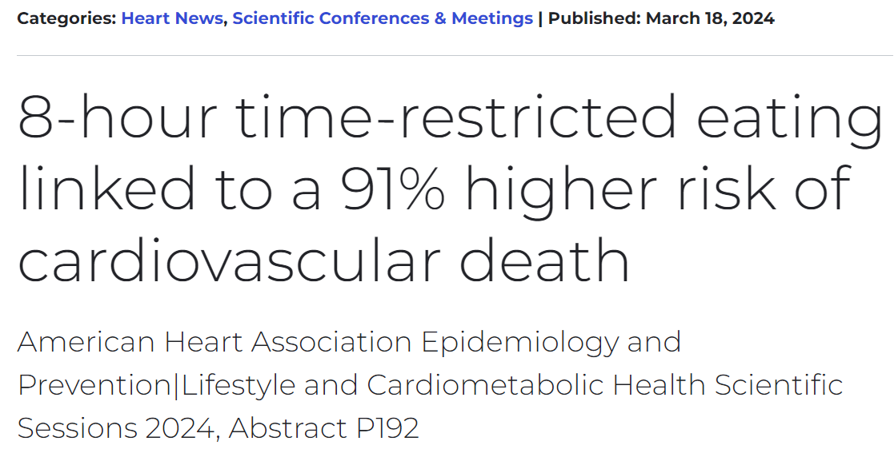
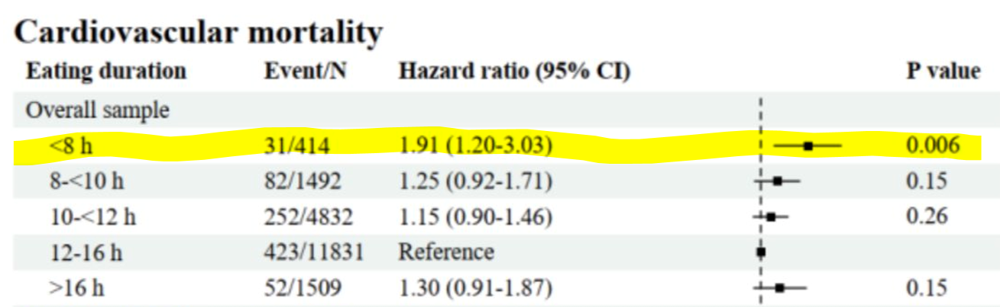
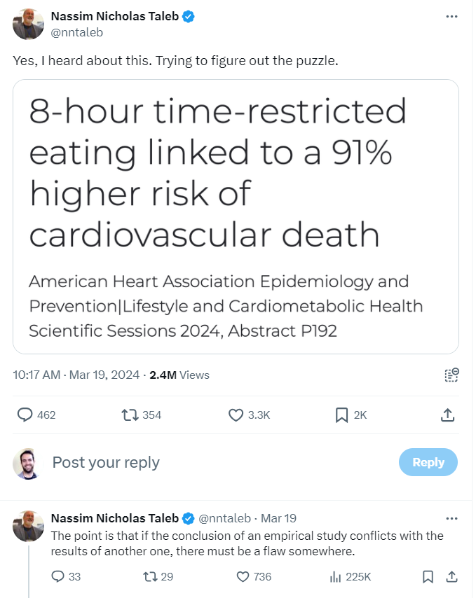
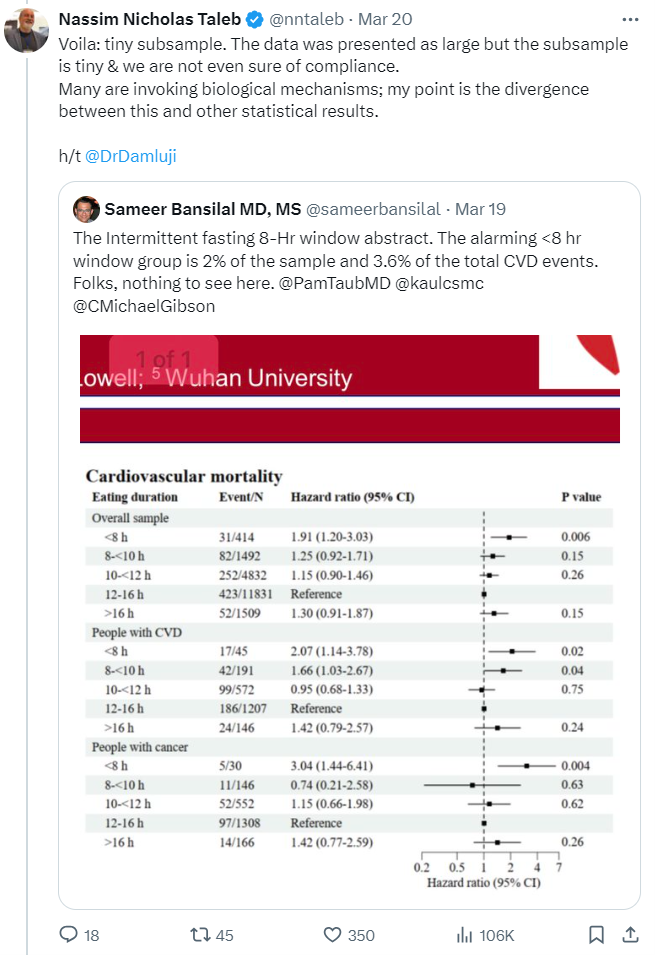
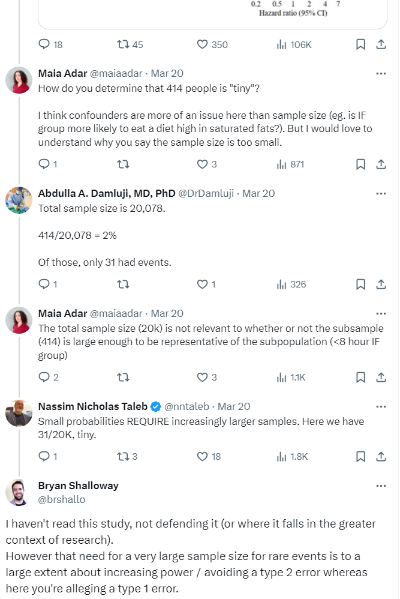
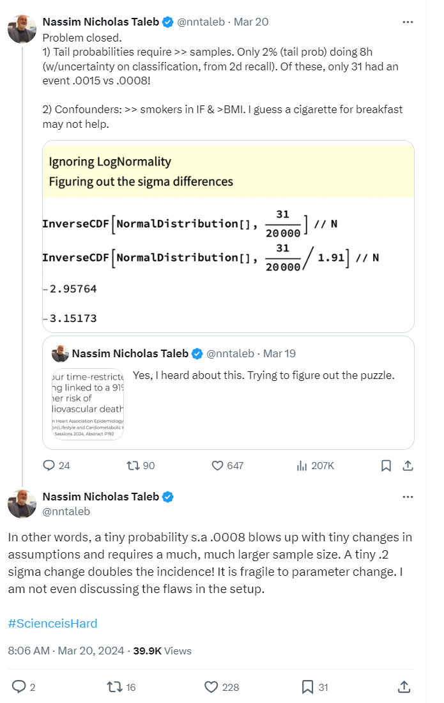
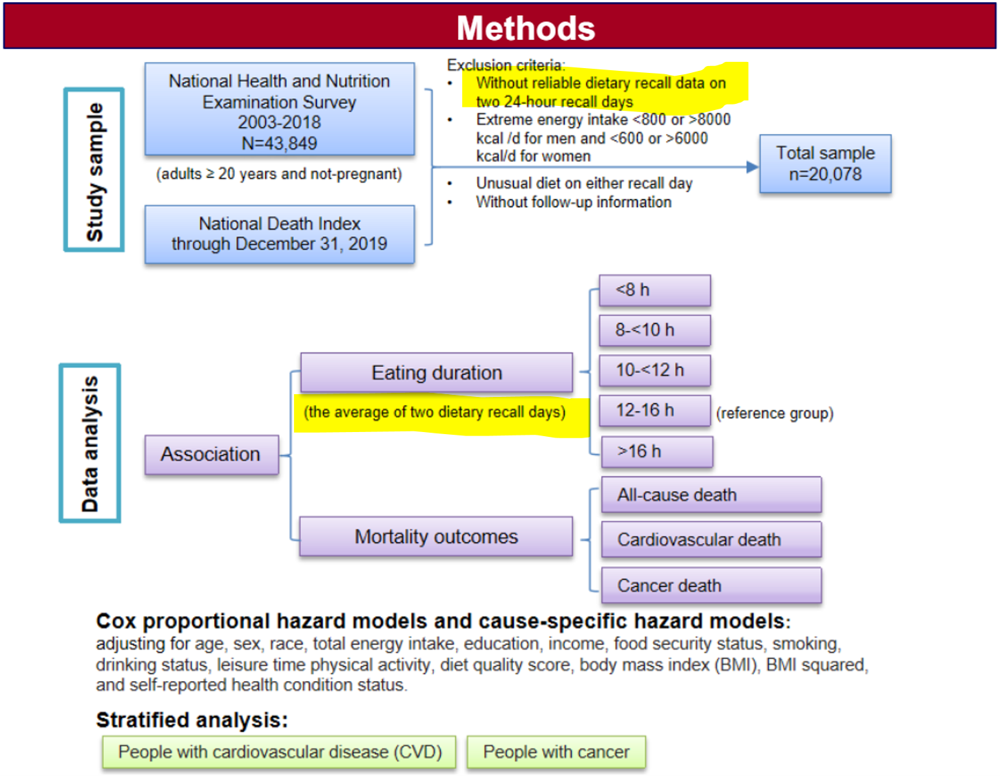
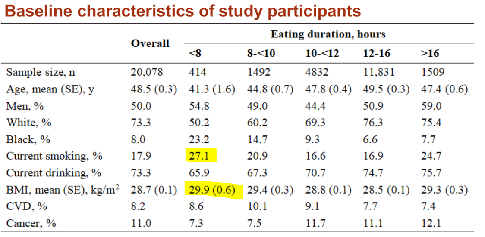
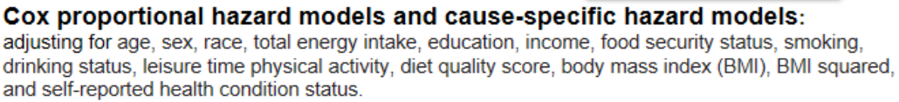
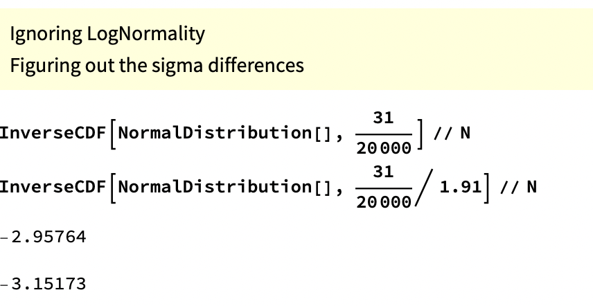

**TLDR:** *Parts of Taleb's critique of an, albeit overhyped study on Intermittent Fasting, seem specious.*

Veritasium recently put out a video on "The Problem With Science Communication" that details how news outlets and science journalism gravitate to big headlines that are often misleading, overstate the findings, or are outliers that go against the weight of evidence in the field. The video doesn't just fault news outlets but also suggests labs and research institutions are incentivized to put out punchier sounding press releases that summarize their findings in ways that are more likely to draw media attention to their work. 

<iframe width="560" height="315" src="https://www.youtube.com/embed/czjisEGe5Cw?si=gRl9z2IMfr-zX70M" title="YouTube video player" frameborder="0" allow="accelerometer; autoplay; clipboard-write; encrypted-media; gyroscope; picture-in-picture; web-share" referrerpolicy="strict-origin-when-cross-origin" allowfullscreen></iframe>

In March a headline grabbing summary of a study came-out regarding an association between Intermittent Fasting and cardiovascular mortality. The American Heart Association's release is largely representative of the media coverage^[There were also plenty of headlines and articles that spoke broadly to the field of study rather than focusing disproportionately just on the initial findings of this unreleased study.]:



These and other reports were based on a poster and abstract summarizing the study^[Links of which can be found at the [AMA release](https://newsroom.heart.org/news/8-hour-time-restricted-eating-linked-to-a-91-higher-risk-of-cardiovascular-death)]. The actual paper had not yet been released. The specific part of the poster that drew so much attention was this table of results that showed a greater risk of cardiovascular death in those practicing intermittent fasting (eating within a less than 8 hour window) compared to the reference group:



## Nassim Taleb's comments

Around this time I had just started reading Taleb's book *Antifragile.* Early in the book he has an aside where he advocates for the health benefits of Intermittent Fasting^[As part of a section where he describes the benefits of exposing the body to natural stressors.]. Checking-out Taleb's posts on X, I saw that he had a number of posts commenting on the recent study. He initially expressed surprise at the results^[He also noted that there [didn't seem to be any relevant financial conflicts of interest](https://x.com/nntaleb/status/1770193299980402951).]:



He goes on to make a few criticisms of the study and later states that "small probabilities REQUIRE increasingly larger samples":



For the remainder of this post I will discuss his complaints regarding sample size in relation to the event rates observed in this study^[Which he suggests is all that is needed to dismiss the results, even if you ignore potential issues in setup: https://x.com/nntaleb/status/1770467069454073997].

There is indeed a need for a larger sample when there is a low event rate (414 participants in the intermittent fasting group is smaller than ideal)[^study-design]. However this sample size is not on its own a justification for throwing-out the small p-value on a post-hoc basis. The p-value represents (taking into account the sample size and the underlying variability / event rate) how likely it is you would get the observed results by random^[p-value of 0.006 suggests these results are unlikely to have occurred by chance alone.]. The need for a large sample size in the case of rare events often has more to do with increasing the power of your study to accommodate for the difficulty of detecting rare events^[related to type 2 errors: ~failure to detect an effect when one truly exists -- a false negative] compared to the problem (that Taleb is alleging) of getting a false positive finding where an effect actually does *not* exist^[Which relates to a type 1 error] ^[The points in this paragraph are also articulated in my [reply](https://x.com/brshallo/status/1772422125069963359) on his thread: ].

[^study-design]: The concern about sample size often comes up during study design. (Note also that this study is using a database from a national survey, this isn't an experiment or something where they are able to control sample size directly.) If the thing you are measuring is rare, you will need a much larger sample in order to detect it. This increases your "statistical power": the chance you will reject the null hypothesis (i.e. get a small enough p-value) if indeed you should reject it. Given the underlying event rates and an alpha of 0.05 -- a common default -- a sample size of 414 would indeed likely be too small, but for the reason that this wouldn't give you enough statistical power (a common default for statistical power is 0.80 and this sample size, given the other parameters, would put you short of that). (...at most points in this post I write a bit colloquially / loosely so as to avoid using terms like null hypothesis...)


Still, again excluding other concerns regarding study design, a researcher might question the validity of the p-value of 0.006 based on the fact that multiple tests were done within the study^[and call for a corresponding adjustment of the p-value that takes this into account like a [Bonferroni correction](https://en.wikipedia.org/wiki/Bonferroni_correction), an approach Taleb does mention in *Antifragile*.] or critique the use of frequentist statistics and instead suggest using Bayesian approaches or nonparametric methods^[It's tough to know without actually trying it, my guess is p of 0.006 would have a good chance surviving adjustments in statistical approach though.]. (As a reminder, we're just looking at a poster, the paper is not available, so we don't know the details of the approach the researchers used and whether we would approve of their methods.) However if you've read anything by Taleb you'll know he rejects much of mainstream statistical inference^[Calling himself a "probablist."] and so his critiques tend to be more sweeping than just nitpicking the choice of statistical testing methodology.

## "sigma change that doubles incidence"

While I found Taleb's commentary overly harsh in the context of what we knew about the study, calling for a larger sample when studying rare events is generally a good idea; so my critique of his criticism at first felt pretty banal. However, after reading Taleb's follow-up tweets explaining his position, I got the feeling his approach to thinking about small sample sizes in the context of this study goes a bit off-the-rails. Take a moment to read his tweets below for yourself and see if you can follow his reasoning and, in particular, how his calculations support it:



He packs a lot in here[^misunderstand] and after rereading it several times I think a lot of it falls somewhere from incomplete to uninformative to misleading. I will parse-out what he is saying^[I'm mostly just talking about "1" as I'm mainly concerned with discussing his calculations concerning sample size and event rate in relation to his "sigma change that doubles incidence" metric that he cooks-up.] and offer some commentary:

[^misunderstand]: A lot of people on X will say something and leave the explanation and context unsaid, which is fine but can also lead to misunderstandings. Taleb seems particularly at risk of this as he has a lot of technical posts but most of the replies and quoted reposts seem to be primarily Taleb fans hyping him up rather than people meaningfully parsing his arguments. There's also a risk of [context collapse](https://en.wikipedia.org/wiki/Context_collapse), that I wonder a bit if maybe I've fallen into here, where his posts are aimed at those who are highly versed in the methods / jargon he uses in his books and writing.


* "Only 2% (tail prob) doing 8h": There are 20,078 total individuals in the study, 414 of which were in the intermittent fasting group (eating within an 8 hour window), which represents about 2% of total participants ($\frac{414}{20,078}$). This 2% subsample is not particularly surprising as it just shows that most people in the survey the study is based on didn't practice intermittent fasting[^subsample-prop]. Calling this proportion of total participants a "tail" seems strange as it's not clear why you would characterize this group as existing in the "tail" compared to anywhere else along the population distribution[^tail-wording].

[^subsample-prop]: Taleb focuses a lot (here and in other tweets on this topic) on the relative size of the intermittent fasting group (2% of total study) over the raw number of samples in the group (414 individuals). The study is building a global model across participants and with many variables. Hence, there are circumstances where the relative proportions of different groups *could* theoretically influence the rates of different types of statistical errors (as opposed to just the raw number of samples) and contribute to some instability of estimates (/fragility). However it's at least not obvious what the mechanisms would be for this leading to more false positive results and I don't find the mechanisms he suggests, e.g. regarding misclassification of eating duration group, that compelling... I thought about setting-up a simulation to look at Type 1 error rates of coefficients if you vary the group proportions to get a better look at this and under what conditions this "relative proportion size of each group in relation to total" may actually effect things but didn't get to it... maybe in a future post...

* "(w/uncertainty on classification, from 2d recall)": To be included in the study, surveyed participants had to have two days where they were able to recall their dietary intake, including the timing of meals. The average length of the eating windows in these recalls was used to group participants into "eating duration" groups (of either "<8h," "8<10h," "10<12h," "12-16h," or ">16 h")[^example]. Taleb is suggesting that only requiring 2 recall days (/surveys) to sort people into eating duration groups brings the risk of a high misclassification rate. While this is a fair concern, it's not obvious why some people being put into the wrong "eating duration" group would increase the chance of getting a false positive result in the broader study^[To increase the risk of detecting a false effect there'd generally have to be some kind of association between misclassification and the outcome, which is possible, but is a purely skeptical assertion. There is also the classic p-hacking problem where you just have a bunch of random results and only the "statistically significant" ones get picked-up for publication. This is a problem researchers face. However my interest with this post is in reviewing the explanations Taleb supports his argument with.]. Uncertainty in subgroup classification often adds noise and reduces the power to find a positive result yet in this case Taleb is accusing the study of *falsely* detecting an effect that doesn't actually exist.  
*Screenshot of methods section from poster (that shows approach regarding dietary recall days):*

[^tail-wording]: My guess was that this "tails" terminology is in order to set-up Taleb's ensuing calculations which look at the tails of normal distributions. However this construction feels strained and the approach inappropriate. "Tails" could also just be a linguistic way of emphasizing that 2% is a small proportion of the total data... or leaning into Taleb's tendency to frame things in terms of "tails" (though this framing seems inappropriate here). It could be that I'm not following something.

[^example]: For example if a participant ate everything within 5 hours on one of their recall days and then within 9 hours on another, the average of these would be 7 hours so they'd be grouped into the "<8 h" group ("<8 h" corresponds with Intermittent Fasting).



* "Confounders: >> smokers in IF & BMI.": He is pointing to the "Baseline characteristics of study participants" in the poster where you can see that the intermittent fasting group tends to have a higher rate of smoking and a higher Body Mass Index (BMI) than other groups (I'm surprised he doesn't point out the higher "Black, %" as well):

  

  Confounding is difficult to speak to without the data or more information, however I'll just note that if you look back at the methods section you'll see that the model is supposedly accounting for these variables (as well as a bunch of others) when calculating the relative hazard.

  

  That there are so many variables being controlled for could further reduce the power of the study which might actually make it more surprising to see a statistically significant result unless there is a strong underlying effect. Also, if there is multicolinearity between the variables (which he alludes to), this would tend to inflate the standard errors and cause instability in your parameter estimates. This can lead to weird effects, one common byproduct though is also a reduction in the ability to reach statistically significant results. However, as I mentioned previously, the effects of confounding can get complicated so I don't want to focus too much on this as my interest is primarily in the calculations Taleb uses to support his skeptical stance concerning event rates. 

* "Of these, only 31 had an event .0015 vs .0008!": 0.0015 comes from $\frac{31}{20,078}$ i.e. out of the ~20,000 people surveyed, ~0.15% of those individuals were intermittent fasting and also died of cardiovascular failure. The 0.0008 is where things get confusing, it comes from $\frac{\frac{31}{1.91}}{20,078}$
. I interpret this as essentially saying that if you took the intermittent fasting group's subsample size and applied the reference level's lower hazard rate ($\frac{31}{1.91}$) you would only have expected to get ~16 deaths, those 16 expected deaths then would only have represented ~0.08% of total data in the study ($\frac{16}{20,078}$). Restating this: if it's *actually* the case that the intermittent fasting group *doesn't* have a higher mortality rate, then you would have expected 16 deaths in that subsample which would represent ~0.08% of total data in the study^[Speaking loosely, this part comes off as having an almost false resemblance to what a p-value gets at, which is sort of: "how unlikely is it that you would have seen 31 deaths when you would have expected to see just 16 based on the reference level and underlying data/attributes."]. 

  A problem here is he's taking a series of somewhat irrelevant conjunctive steps to build up these tiny proportions. To a large extent, these proportions are small just as a function of intermittent fasting being comparatively uncommon in the national survey used by this study^[A reason the subsample's size relative to the total study might seem relevant is that if there is improper classification of people into their eating duration groups, as he suggests (mentioned previously above), then the relative rates could matter as subsamples bleed into one another. However as I note in the prior bullet, that could reduce the chance of observing an effect as it may be washed out by noise, rather than raising the risk of a Type 1 error (as he suggests). While there are also mechanisms where a type 1 error may become more likely... without further details, it's overly speculative to conclude how it would affect the results.]. 

* Next he displays some Mathematica code to show that "A tiny .2 sigma change doubles the incidence!":



This code is taking the proportions mentioned previously and then putting them in terms of percentiles (tails) of data on a normal distribution^[This seems like a strange thing to do for a number of reasons... but as mentioned previously, it's not clear why, when grouping the subsamples into a population distribution, the intermittent fasting group should go at the tails rather than anywhere else in the distribution (where the density may differ).]. The 0.15 percentile would be at -2.96 standard deviations from the center and the 0.08 percentile would be at -3.15 standard deviations from the center -- i.e. everything to the left of -2.96 represents 0.15% of the data and everything to the left of -3.15 contains 0.08%.  
*Visual representation:*

```{r, cache = TRUE, echo = FALSE}
library(ggplot2)

# Values for the vertical lines
z_values <- c(qnorm( (31 / 1.91) / 20000), qnorm(31 / 20000)) |> round(2)

# Create a sequence of x-values (z-values) for the normal distribution
x_values <- seq(-4, 4, length.out = 1000)

# Calculate the density of the normal distribution for these x-values
y_values <- dnorm(x_values)

# Create a data frame for plotting
data <- data.frame(x_values, y_values)

# Plot the normal distribution
p <- ggplot(data, aes(x = x_values, y = y_values)) +
  geom_line() + # Add the normal distribution curve
  geom_vline(aes(xintercept = z_values[1], color = paste("z =", z_values[1])), linetype = "dashed") + # Add the first vertical line
  geom_vline(aes(xintercept = z_values[2], color = paste("z =", z_values[2])), linetype = "dashed") + # Add the second vertical line
  scale_color_manual(
    name = "",
    values = c("blue", "purple"),
    labels = paste("z =", rev(z_values))
  ) +
  geom_ribbon(data = data[data$x_values <= z_values[1], ], aes(ymax = y_values), ymin = 0, fill = "purple", alpha = 0.2) + # Fill area to the left of the first line
  geom_ribbon(data = data[data$x_values > z_values[1] & data$x_values <= z_values[2], ], aes(ymax = y_values), ymin = 0, fill = "blue", alpha = 0.2) + # Fill area between the lines
  theme_minimal() +
  theme(axis.text.y = element_blank()) +
  labs(title = "Left of z-scores -2.96 and -3.15 represent 0.15% vs 0.08% of data respectively",
       subtitle = "(on a normal distribution)",
       x = "Z-score (standard deviations from center)",
       y = "Density")

ggsave("images/normal-dist.png", plot = p, width = 7, height = 5)

# Display the plot
print(p)
```


He then states that a relatively small move to the right of just ~0.2 standard deviations (3.15 - 2.96) leads to a doubling of incidence^[but actually a 1.91x increase of incidence as that's the hazard ratio which he divided things by to manufacture this example.]: 

>"In other words, a tiny probability {such as} .0008 blows up with tiny changes in assumptions and requires a much, much larger sample size. A tiny .2 sigma change doubles the incidence! It is fragile to parameter change. I am not even discussing the flaws in the setup."^[He leans into this point, asserting that he can dismiss the results using just this methodology without even considering other aspects the study. This confidence in a methodology that seems inappropriate is what made me decide to convert my thoughts into this blog post.]

However, this "small sigma change leads to doubling of the incidence" has little to do with the rare event rate or small sample size. Instead it's mostly the arbitrary result of an inapplicable methodology that, even under conditions where an effect/association is obvious, could speciously support skeptical statements.

For example, let's change the data to remove the "rare event rate" problem^[This study is looking at death rates of ~3.5 to 7.5% not the "black swan" events that Taleb writes a lot about but still somewhat rare.] and increase the death rates by 5x so the rate in the intermittent fasting group is now ~37% (and keep the same hazard ratio with the reference level). The "change in sigmas that ~doubles incidence" measure only goes up to ~0.23^[The incidence rate is still roughly doubled (1.91x) which makes sense as the relative incidence rate here is just a product of dividing by the hazard ratio.]:

```{r}
# This is R code for the same types of calculations Taleb had previously done in Mathematica
c(qnorm( (31 * 5) / 20000), qnorm( (31 * 5 / 1.91) / 20000)) |> round(2)
```

Now let's also remove his "the intermittent fasting subsample represents just 2% of the participants in the total study" problem by also multiplying this by 5x (so this hypothetical intermittent fasting group would now represent ~10% of survey participants and would have a death rate of ~37%, again keeping the same relative hazard with the reference level). Our "difference in sigmas that ~doubles incidence" measure still only goes up to 0.28:

```{r}
c(qnorm( (31 * 5 * 5) / 20000), qnorm( (31 * 5 * 5 / 1.91) / 20000)) |> round(2)
```

Even if you made it so *half* of the 20,000 participants were in the intermittent fasting group (and kept the 5x death rate -- so 3,700 deaths in the intermittent fasting group) your "difference in sigmas that ~doubles incidence" would only go up to 0.4. Hence even with data that shows an obvious effect, Taleb's calculations could superficially make it seem like the results are "fragile to parameter change."

His approach also somewhat begs the question because what "difference in standard deviations from reference level that ~doubles incidence" would Taleb accept as being substantive^[A common cut-point in traditional statistical analyses is to say if something is ~2 standard deviations from the reference level it is "statistically significant" (as this achieves a p value of <0.05 so is unlikely to be the result of chance). However it's not clear what Taleb is looking for and his approach here isn't a statistical test.]...? but mostly this just isn't a way to test things.

## Wrapping-up

I am not trying to defend this study. I can appreciate the instinct to put down a (not even released) paper that has garnered an undue amount of attention and that may go against other results in the field^[I don't know anything about Intermittent Fasting or the relevant research so can't speak to that]. Observational as well as survey-based studies have notorious weaknesses. It's also interesting that the study doesn't find a statistically significant difference in the "all cause mortality" rate for intermittent fasting^[This may have to do with the small sample size of the group and the study being underpowered.]. Furthermore, I don't think raising question marks related to sample size or event rate is a bad thing^[I'm somewhat hesitant to make a purely skeptical "well if you just move some of the observations around" hypothetical but it is indeed the case that if you move maybe somewhere between 7 and 14 of those cardiovascular deaths out of the "Intermittent Fasting" group and into another group you would likely no longer see a statistically significant result. (I don't know exactly how many observations you'd need to move as I don't have access to the model or the underlying data -- that has things like censoring information and the attributes associated with each observation -- which would be needed to do a sensitivity analysis and provide a precise review of how resilient that p value of 0.006 actually is.) While I'm skeptical that the "poor classification into eating duration groups" mechanism Taleb suggests is that likely to add to the risk of Type 1 errors... it is indeed the case that studies of rare events tend to be more sensitive and reminding people of that is often helpful.]. There are plenty of fair reasons to be skeptical. Where I think Taleb goes wrong is that rather than asking questions, or offering areas where he'd like to see further investigation, he rejects the results out-of-hand and then supports his position with what appears to be complicated nonsense[^story].

[^story]: Taleb has a story in *Antifragile* where he derides his business school professors by saying how he would essentially trick them into giving him better grades by adding a bunch of obfuscative pseudo-analytical jargon. I couldn't shake the thought that maybe there is a little bit of that here. However, giving him the benefit of the doubt, I think it's more likely that Taleb, being a prolific and highly opinionated poster, just didn't think things through that much on this one. I also may be being a bit too harsh in this post... then another part of me wonders if I'm missing something and his "difference in sigmas that doubles incidence" methodology does actually support his point in some meaningful way that I don't see.


