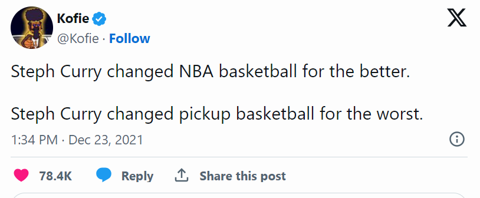

```{r setup, include=FALSE}
knitr::opts_chunk$set(echo = TRUE, warning = FALSE, message = FALSE, cache = TRUE)
```

**TLDR:** *For full court pickup basketball you should play by 2s and 3s. Make-it-take-it by 1s and 2s is also fine. Adapt your game according to the scoring and possession system in place.*

Steph Curry is sometimes blamed for ruining pickup basketball:



The argument is that people in pickup games see Steph launching 3's, emulate him -- but aren't as talented -- so games become a mess of people bricking long range shots with hardly any real basketball going on.


Another idea is that Steph is less to blame for this phenomena than the incentives embedded in the most common [scoring system in pickup basketball]: 1's and 2's. In 1s and 2s if you can hit a long distance shot at least half as often as an interior shot, it makes sense to take it because the expected value (/points) is greater than for an interior shot. You can find [people on Reddit arguing](https://www.reddit.com/r/Basketball/comments/195vxba/basketball_is_meant_to_be_played_scoring_2s_and/) these and related points. 

I lean towards the incentives based perspective. This post will be a review of the "balance" of games under different scoring and possession systems. I'm defining "balanced" games as those where the expected points from interior and long range shots are similar to one another.

To make this explicit, say the average team^[It's not that every player has to have a 30% long range shooting percentage and 45% interior shooting percentage. It could be that some of the players on the team are far worse at shooting 3s, but they just won't take those shots.] shooting percentage for interior shots is 45% and the average for long-range shots is 30% (for my examples the specific shooting percentages don't matter so much as that the ratio between *interior : long range* shooting stays close to *0.45 : 0.30*)^[This isn't completely true when considering make-it-take-it but as long as things don't depart too much from the shooting percentages I'm using, most of the takeaways stay the same.]. If you're playing 2s and 3s, the expected value of an interior shot is $2 \times 0.45 = 0.9$ and the expected value of a long range shot is $3 \times 0.3 = 0.9$ -- i.e. the expected value of both types of shots is equivalent (perfectly balanced). Given these shooting percentages (and ignoring offensive rebounds^[I'm also ignoring free throws because playing with these are exceptionally rare in pickup basketball.]) the expected value in 1s and 2s would be $1 \times 0.45 = 0.45$ for an interior shot and $2 \times 0.3 = 0.6$ from distance. In this scenario a long range shot comes with 33% more value (29% if using a symmetric measure^[[Article](https://patrickjuli.us/2016/01/27/how-i-wish-we-measured-percentage-change/) on symmetric measure for percentage difference.] of percent difference).

The 2s and 3s scoring system is the minority position in most pickup games^[Article surveying the most common [rules of pickup](https://www.sbnation.com/lookit/2015/4/7/8353509/what-are-the-rules-of-pick-up-basketball-survey).] but is somewhat more popular among analytics oriented players and common practice among the converted^[and finds sympathy among those without a jump shot]. Hence the conventional sports nerd wisdom is to advocate for playing by 2s and 3s (see [How to Fix Pickup Basketball...](https://grantland.com/the-triangle/video-how-to-fix-pickup-basketball-with-analytics/)). However that analysis doesn't take into account possession. 

## What if you're playing make-it-take-it?

*2s and 3s is only more balanced when you alternate possession after each score.* While alternating possession is the norm in full court pickup basketball, in half court the more common play style is for the scoring team to retain possession -- called "make-it-take-it." Under these conditions^[and continuing to ignore turnovers, offensive rebounds, and other complicating factors], calculating expected points is a little more complicated as you need to consider not just the expected points of the shot attempt but also the value associated with the chance of retaining possession (and making future shots) if you score.

Calculating the expected points for a shot is no longer just: 

$\text{(points)} \times \text{(shooting %)}$  

but:

$\left(\text{points}\right) \times \left(\text{shooting %}\right) \\+ \left(\text{chance last shot was made}\right) \times \left(\text{points}\right) \times \left(\text{shooting %}\right) \\+ \left(\text{chance last two shots were made}\right) \times \left(\text{points}\right) \times \left(\text{shooting %}\right) \\+ \ldots \left(\text{and so on and so on}\right) \ldots$

If we consider the expected points of an interior shot (when playing 1s and 2s) the series can be approximated as:

$$
1 \times 0.45 + 1 \times 0.45^2 + \ldots + 1 \times 0.45^n
$$

You might recognize this from calculus as a geometric series and notice that because each additional term in the series gets smaller and smaller towards 0, the total value of the sum will converge to a constant. The value of a converging infinite geometric series can be represented by the simple equation^[[Proof on Khan Academy](https://www.khanacademy.org/math/integral-calculus/ic-series/ic-geometric-series/a/proof-of-infinite-geometric-series-formula)]:

$$
\frac{\text{(start value)}}{(1 - \text{rate})}
$$

We can use this to approximate the expected points for a shot attempt when playing make-it-take-it (see [But you don't play pickup basketball to infinity] for why this is just an approximation). If we plug in our values for a 1 pointer with 45% chance of being made:

$$
\frac{(0.45 \times 1)}{(1 - 0.45)} = 0.82
$$

and compare this to the rough expected points of a 2 pointer at 30%:

$$
\frac{(0.30 \times 2)}{(1 - 0.30)} = 0.86
$$

This shows a less than 5% difference in approximate expected points if taking an interior or long range shot when playing make-it-take^[Maybe a slight edge for long range shots but pretty close (i.e. balanced).]. This is pretty balanced, which is good news because 1s and 2s make-it-take-it is the norm for half court pickup basketball. Let's compare this relative balance to the relationship between the expected values when playing make-it-take by 2s and 3s. Approximate expected points for a 2 pointer in make-it-take-it:

$$
\frac{(0.45 \times 2)}{(1 - 0.45)} = 1.64
$$

vs a 3 pointer:

$$
\frac{(0.3 \times 3)}{(1 - 0.3)} = 1.29
$$

Under these conditions, an interior shot has almost 27% greater expected value than taking a long range shot (24% symmetric percent difference). In this case 2s and 3s is almost as imbalanced for interior shots as the 33% advantage we saw for distance shooting when playing 1s and 2s with alternating possession. So if you're playing make-it-take-it, you actually shouldn't do scoring by 2s and 3s^[It's good then that 2s and 3s make-it-take-it is somewhat rare.].

## Summary

The two game conditions that promote similar expected values for interior and long range shots are 2s and 3s with alternating possession after scores as well as make-it-take-it by 1s and 2s^[The other play formats lead to imbalances that favor either long range or interior shooting.]. 

```{r}
# Load the gt package
library(gt)
library(dplyr)

# Function to calculate percentage difference and format the string
format_with_difference <- function(value1, value2) {
  diff <- round(abs(value2 - value1) / ((value1 + value2) / 2) * 100, 0)
  return(paste0(value1, " : ", value2, "<br>(", diff, "% difference)"))
}

# Update the data frame with formatted strings
data <- tibble(ShotType = c("1pts : 2pts", "2pts : 3pts"),
               MakeItTakeIt = c(format_with_difference(0.82, 0.86), format_with_difference(1.64, 1.29)),
               Alternating = c(format_with_difference(0.45, 0.60), format_with_difference(0.90, 0.90)))

# Create a gt table
table <- gt(data) %>%
  # Add a title and subtitle
  tab_header(
    title = "Relative differences in expected points of shot type",
    subtitle = md("Given shooting percentages of... *interior: 45% ; long range: 30%*")
  ) %>%
  # Add spanner column label with italicized text
  tab_spanner(
    label = md("**Possession after a score**"),
    columns = c(MakeItTakeIt, Alternating)
  ) %>%
  tab_spanner(
    label = md("**Points assigned**"),
    columns = c(ShotType)
  ) %>%
  # Customize column labels
  cols_label(
    ShotType = md("*interior : long-range*"),
    MakeItTakeIt = md("*make-it-take-it*"),
    Alternating = md("*alternating*")
  ) %>%
  # Add vertical lines and other styles
  tab_style(
    style = cell_borders(
      sides = "right",
      color = "lightgray",
      weight = px(1)
    ),
    locations = list(
      cells_body(columns = MakeItTakeIt),
      cells_column_labels(columns = MakeItTakeIt)
    )
  ) %>%
  tab_style(
    style = cell_borders(
      sides = "left",
      color = "lightgray",
      weight = px(2)
    ),
    locations = cells_body(columns = c(MakeItTakeIt))
  ) %>%
  tab_style(
    style = cell_borders(
      sides = "right",
      color = "lightgray",
      weight = px(2)
    ),
    locations = cells_column_labels(columns = c(ShotType))
  ) %>%
  tab_style(
    style = cell_text(
      align = "center",
      style = "italic"
    ),
    locations = cells_body(columns = c(ShotType))
  ) %>%
  tab_style(
    style = cell_text(
      color = "darkblue"
    ),
    locations = cells_title(groups = "title")
  ) %>%
  # Render the markdown in the cells
  fmt_markdown(columns = c(MakeItTakeIt, Alternating)) %>%
  tab_footnote("Symmetric absolute percent difference used as metric for % difference.") %>%
  tab_style(
    style = cell_text(size = px(10)),
    locations = cells_footnotes()
  )

# Print the table
table
```

## Taking action

You might think that the expected values of different shots would naturally balance out. For example, if you're playing by 1s and 2s with alternating possession (where deep shots are more valuable) players could defend long range shots more aggressively which would lead to the shooting percentage on those shots dropping relative to interior shots. In practice though, this realignment does not happen as much as would be expected by fully rational players^[Also some adjustments may be difficult to make regardless of intention.]. Instead, many people anchor their play style to whatever brand of basketball they are accustomed and do not fully adjust to the scoring and possession system in place. Given these tendencies, *what should you do?*

1. Advocate for a balanced scoring system^[Being the ethical and upstanding individual you are, you should advocate for the most balanced system available. A more cynical person might say that you should try and skew the scoring system to whichever gives your team the greatest advantage... however I think it's more fun to just try and keep things balanced.]

This means if you're playing full court (with alternating possessions after scores), push for playing by 2s and 3s to 21 (rather than the more common 1s and 2s to 15). If you're playing half court, you don't need to do anything as games are typically played make-it-take by 1s and 2s, which has mostly fine incentives^[You *could* push for 2s and 3s with alternating possession though which is a little more balanced and has the advantage of being more robust to variations in shooting percentage which I touch-on in a footnote in [Other considerations].]. 

2. Arbitrage

In many cases you will not be able to influence the scoring system. Other players not fully adapting to unbalanced values of shots is an opportunity. If the system advantages long range scoring, get your best shooter as many decent looks as possible and push your team to play tough exterior defense[^well-balanced-games].

[^well-balanced-games]: Even under reasonably balanced rules you can still find opportunities where people don't play in-line with expected value. One example, is in 1s and 2s make-it-take-it some players will be overly concerned about long range shots (and under appreciate the value of retaining possession) and defend in a way that opens themselves up to drives and high percentage interior shots. This is particularly the case if playing with less than 10 players (e.g. 3 vs 3 or 4 vs 4) where interior play is already more open and the shooting percentage on interior shots likely goes up by more than it does for long range shots.

## Other considerations

The conclusion that "1s and 2s make-it-take-it" and "2s and 3s alternating possession" make for the most balanced games depends on my guesses for standard shooting percentages[^personal-problems]. 45% : 30% for interior and long range shots are reasonable estimates for competitive pickup games but may not apply universally[^ratios-relations]. 

[^personal-problems]: There's also the possibility that much of this post is rationalizing my own frustrations at growing up without a decent jump shot and having to always play 1s and 2s.

[^ratios-relations]: In the case of alternating possession, proportion imbalanced is linearly related to the ratio of {interior shooting %} : {long range shooting %}, e.g. in the case of 2s and 3s alternating possession, what matters is not the specific shooting percentages but how far they deviate from the ratio of 0.45 : 0.30. However when playing make-it-take-it the relationship is not linear (though within a small window of shooting percentages a linear relationship works OK as an approximation).

The chart below shows, across a range of possible interior and long range shooting percentages, the relative imbalance in expected points under each of the four {possession} x {scoring} conditions[^chart-notes]. 

[^chart-notes]: The "perfect balance" equations were found by setting the interior and long range expected points equations equal to each other and simplifying.

```{r imbalance-across-pcts}
library(dplyr)
library(tidyr)
library(ggplot2)
library(purrr)

shooting_pcts <- crossing(
  tibble(pct_long = seq(0.10, 0.40, by = 0.01)),
  tibble(pct_short = seq(0.20, 0.60, by = 0.01))
)

shots_pts <- tibble(pts_long = c(2,3),
       pts_short = c(1, 2)
)

exp_value_alternating <- function(pts, percent) pts * percent

exp_value_makeitakeit <- function(pts, percent) (percent * pts) / (1 - percent)

total_pct_difference <- function(x, y) (x - y) / ((x + y) / 2)

data_imbalance <- crossing(shooting_pcts, shots_pts) %>% 
  mutate(pts_type = paste0(pts_short, "&", pts_long)) %>% 
  # expected value of each shot
  mutate(exp_short_alt = exp_value_alternating(pts_short, pct_short),
         exp_short_miti = exp_value_makeitakeit(pts_short, pct_short),
         exp_long_alt = exp_value_alternating(pts_long, pct_long),
         exp_long_miti = exp_value_makeitakeit(pts_long, pct_long)) %>% 
  # percentage imbalances
  mutate(alt = total_pct_difference(exp_short_alt, exp_long_alt),
         miti = total_pct_difference(exp_short_miti, exp_long_miti))

data_chart <- data_imbalance %>% 
  pivot_longer(one_of("alt", "miti"), names_to = "possession_type", values_to = "pct_imbalance") %>% 
  mutate(possession_type = ifelse(possession_type == "alt", "alternating", "make-it-take-it")) %>% 
  mutate(type_combine = paste0(pts_type, "; ", possession_type)) %>% 
  mutate(near_0 = near(pct_imbalance, 0, 0.05)) %>% 
  mutate(pct_imbalance = abs(pct_imbalance)) %>% 
  mutate(type_combine = forcats::fct_relevel(type_combine, "1&2; make-it-take-it", "1&2; alternating", "2&3; make-it-take-it", "2&3; alternating"))

data_near <- data_chart %>% 
  filter(near_0) %>% 
  mutate(near_0 = "+/- 0.05 imbalance")

data_reviewed <- data_chart %>% 
  filter(near(pct_long, 0.30), near(pct_short, 0.45)) %>% 
  mutate(label = "Standard shooting conditions:\n45% shooting from interior;\n30% shooting from long range")

# equations for perfect balance
alt_1_2 <- function(x) x / 2
alt_2_3 <- function(x) x / 1.5
miti_1_2 <- function(x) x / (2 - x)
miti_2_3 <- function(x) 2 * x / (3 - x)

perfect_balance <- list(alt_1_2, alt_2_3, miti_1_2, miti_2_3) %>% 
  map(~{tibble(pct_short = seq(0.20, 0.60, by = 0.01)) %>% mutate(pct_long = .x(pct_short))}) %>% 
  map2(list("1&2; alternating", "2&3; alternating", "1&2; make-it-take-it", "2&3; make-it-take-it"),
      ~{mutate(.x, type_combine = .y)}) %>% 
  bind_rows() %>% 
  mutate(type_combine = forcats::fct_relevel(type_combine, "1&2; make-it-take-it", "1&2; alternating", "2&3; make-it-take-it", "2&3; alternating"))


data_chart %>% 
  ggplot(aes(x = pct_short, y = pct_long))+
  geom_tile(aes(fill = pct_imbalance))+
  geom_tile(aes(fill = pct_imbalance, colour = near_0), alpha = 0, data = data_near)+
  geom_line(color = "red", data = perfect_balance)+
  geom_point(aes(shape = label), data = data_reviewed, colour = "violet")+
  scale_color_manual(values = c("red"))+
  facet_wrap(~type_combine)+
  theme_bw()+
  labs(
    title = "Imbalance of expected points by shooting percentages",
    # subtitle = "For 45%; 30%, full court 2s and 3s or make-it-take-it 1s and 2s are most balanced",
    # subtitle = "By scoring and possession rules",
    fill = "Proportion imbalance",
    x = "Interior shooting %", 
    y = "Long range shooting %",
    caption = "Symmetric absolute difference used as metric for proportion imbalance.")+
  theme(legend.key = element_rect(colour="white"),
        legend.position = "right")+
  guides(color = guide_legend(title = NULL, order = 2),
         fill = guide_legend(order = 1),
         shape = guide_legend(title = NULL))+
  scale_y_continuous(limits = c(NA, 0.4), labels = scales::percent)+
  scale_x_continuous(labels = scales::percent)+
  coord_fixed()
```

Everything above the red "perfect balance" lines (or curves in the cases of make-it-take) can be interpreted as shooting percentages where long range shooting has an expected points advantage. Everything below them represents shooting percentages where interior shooting has an advantage[^conditions]. For example, in games where interior shooting percentages are still ~45% but long range shooting is a bit worse (e.g. percentages in the low 20s) 1s and 2s with alternating possession after a score can actually be more balanced than 2s and 3s. However you would be setting-up conditions for a lot of missed shots. 

[^conditions]: You can see where the standard shooting percentages we investigate fall in these conditions. "2&3; alternating" is directly on the "perfect balance" line, "1&2; make-it-take-it" is close to it's perfect balance curve. Whereas "1&2; alternating" is above it's line, indicating an advantage for long range shooting and "2&3; make-it-take-it" is below it's line indicating an advantage for interior shooting. 

    The greater range in color hue for make-it-take-it settings demonstrates how, as you deviate from balanced shooting percentage conditions, shot expected value imbalance grows more quickly than when playing with alternating possession. This is why the points on the graph for "standard shooting percentages" in the upper right and lower left charts are noticeably different distances from the "perfectly balanced" shooting percentage for that condition but similar in terms of proportion imbalanced. 


Sometimes it's better to just play by all 1s.

## Appendix

### But you don't play pickup basketball to infinity

The solutions in [What if you're playing make-it-take-it?] are with infinite series but in pickup basketball you typically play to some fixed value (e.g. 7, 11, 15, 16, 21, 25). Evaluating [Finite geometric series] would allow you to condition your expected value calculations on how many points (or actually scoring possessions) remain. However, the values for the finite geometric series would only substantively differ from our infinite series calculations as you get near to the end of the game. By this point you'd be better thinking in terms of event outcomes rather than expected points. After all you don't really care about expected points but chance of winning^[The expected points calculations for finite geometric series get weird near the end of the game because you can't score more points after the game ends... but this doesn't matter, you just care about getting to the end of the game.]. Event outcomes are a problem of probability rather than expected value and require a different type of analysis. In the future I may do a "Simulating pickup basketball outcomes" post^[E.g. 1s and 2s make-it-take to 11, you're down 9 - 7 with the ball... what are your chances of winning if you...]. However for my purposes in this post (identifying the rules that promote the most balanced games), infinite series work fine as an approximation for expected points. The calculations are also easy to describe as each statement of value does not need to be predicated on how many points remain in the game. From the [Summary] section on I stop saying "approximate expected points" and just say^[This allows me to put both "alternating" and "make-it-take-it" calculations on the same figures without having to clarify that the former is expected points and the latter approximate expected points.] "expected points."

### Finite geometric series

*Much of this section has limited relevance. I left it in mostly just as a check showing that the finite geometric series converge pretty quickly so that as long as you're a few scores away from the end of the game, the infinite geometric series calculations that I use in the body of the post should work fine as a proxy for evaluating relative imbalances in expected values when playing make-it-take-it.*

Calculating the finite geometric series allows us to consider how many points (/scoring rounds) are left in the game. Equation for calculating the value of a finite geometric series:

$$
\frac{\text{(start value)} \cdot (1 - \text{rate}^n)}{(1 - \text{rate})}
$$

In our case, *n* is the number of remaining scoring possessions. However the number of remaining scoring possessions will depend on whether you're shooting interior or long-range shots. Long range shots are worth more points so there would be fewer scoring possessions until the end of the game. For example, if you're playing by 1s and 2s there will be ~half as many scoring possessions remaining if you're sinking long-range compared to interior shots. Taking this into account, let's look at the expected value of each shot (still using our 45% and 30% shooting percentages).

The usefulness of looking at these charts is limited for the reasons described in [But you don't play pickup basketball to infinity] (namely that you should think in terms of event outcomes, particularly near the end of the game). I've also included some point values in the charts that are nonsensical for their scoring system. The purpose of the charts are mainly just to show the pretty quick rate at which the expected values converge -- suggesting that, for most of the game, infinite series are a decent proxy to use when considering relative expected value by shot selection if playing make-it-take-it. 

```{r}
library(dplyr)
library(ggplot2)

finite_geometric_series <- function(start, rate, n){
  (start * (1 - rate^n)) / (1 - rate)
}

data_1s2s_finite <- bind_rows(
  tibble(shot_pts = 1,
         shot_pct = 0.45,
         points_remain = seq(2, 14, by = 1)) %>% 
    mutate(n_rounds = points_remain),
  tibble(shot_pts = 2,
         shot_pct = 0.30,
         points_remain = seq(2, 14, by = 1)) %>% 
    mutate(n_rounds = points_remain / 2)  
) %>% 
  mutate(exp_pts = finite_geometric_series(shot_pts*shot_pct, shot_pct, n_rounds)) %>% 
  mutate(shot_pts_title = ifelse(shot_pts == 1, "interior (1pts; 45%)", "long-range (2pts; 30%)")) 

data_1s2s_finite %>% 
  ggplot(aes(x = points_remain, y = exp_pts, colour = shot_pts_title))+
  geom_line()+
  scale_x_continuous(breaks = seq(2, 20, by = 2)) +  
  theme_bw()+
  ylim(0, NA) +
  labs(
    title = "Expected Value of Shots Based on Points Left in the Game",
    subtitle = "1s and 2s, make-it-take-it",
    x = "Points Left in the Game",
    y = "Expected Value",
    color = "Shot Type"
  ) +
  guides(color = guide_legend(title = NULL))
```

Finite sums for make-it-take-it 2s and 3s: 

```{r}
data_2s3s_finite <- bind_rows(
  tibble(shot_pts = 2,
         shot_pct = 0.45,
         points_remain = seq(3, 24, by = 1)) %>% 
    mutate(n_rounds = points_remain / 2),
  tibble(shot_pts = 3,
         shot_pct = 0.30,
         points_remain = seq(3, 24, by = 1)) %>% 
    mutate(n_rounds = points_remain / 3)  
) %>% 
  mutate(exp_pts = finite_geometric_series(shot_pts * shot_pct, shot_pct, n_rounds)) %>% 
  mutate(shot_pts_title = ifelse(shot_pts == 2, "interior (2pts; 45%)", "long-range (3pts; 30%)"))

data_2s3s_finite %>% 
  ggplot(aes(x = points_remain, y = exp_pts, colour = shot_pts_title))+
  geom_line()+
  # scale_x_continuous(breaks = seq(2, 20, by = 2)) +  
  theme_bw()+
  ylim(0, NA) +
  scale_x_continuous(breaks = seq(3, 24, by = 3)) +  
  labs(
    title = "Expected Value of Shots Based on Points Left in the Game",
    subtitle = "2s and 3s, make-it-take-it",
    x = "Points Left in the Game",
    y = "Expected Value",
    color = "Shot Type"
  ) +
  guides(color = guide_legend(title = NULL))
```

### Scoring system in pickup basketball

*In pickup basketball, two common scoring systems are used: "1s and 2s" and "2s and 3s."*

1. **1s and 2s**: In this system, shots made inside the three-point line are worth 1 point, and shots made beyond the three-point line are worth 2 points. This system puts incentives on long-range shooting because a successful three-point shot is worth twice as much as a shot made inside the arc.
2. **2s and 3s**: Here, shots made inside the three-point line are worth 2 points, and shots made beyond the three-point line are worth 3 points, mirroring the scoring system used in professional basketball.

*Pickup basketball games also differ in how possession is handled after a score:*

1. **Make-it-Take-it**: In this rule, the team that scores retains possession of the ball. This is common in half-court games.

2. **Alternating Possession**: In this rule, possession alternates between teams after each score. This is almost always the way possession is handled in full-court games.
